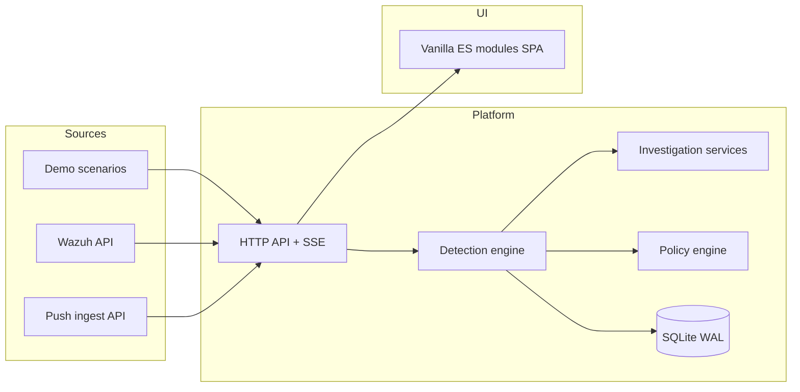
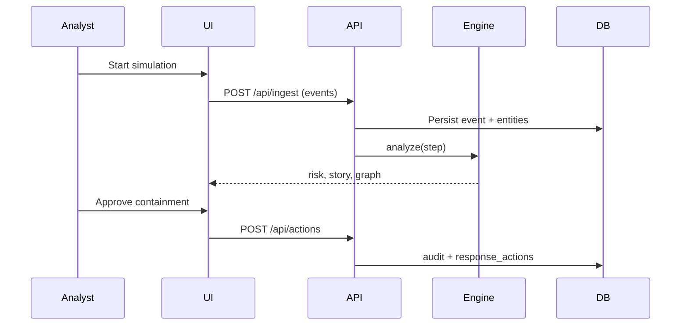

# SENTINEL-X Architecture

## System context

## Request flow

## Layer responsibilities

| Layer | Path | Responsibility |
|-------|------|----------------|
| Presentation | `src/ui/`, `src/app/` | SOC workspace, graph, governance UI |
| API / middleware | `server.js`, `server/api.js`, `server/operations.js` | Auth, rate limit, CSP, routing |
| Domain | `src/engine.js` | Normalize, detect, correlate, risk, policy |
| Services | `services/*` | ML, LLM guardrails, PDF, Wazuh, agents |
| Persistence | `server/db.js` | 20+ tables, migrations, retention |
| Integrations | `services/telemetry.js`, `services/wazuh.js` | External telemetry |

## AI architecture rule (per spec)

| Mechanism | Use |
|-----------|-----|
| Isolation Forest + MAD | Anomaly detection |
| Rules / temporal correlation | Event relationships |
| Graph | Entity relationships |
| LLM (optional) | Natural language — **verified against evidence** |
| Deterministic engine | Risk + policy |
| Feedback | Threshold + retrainable model |
