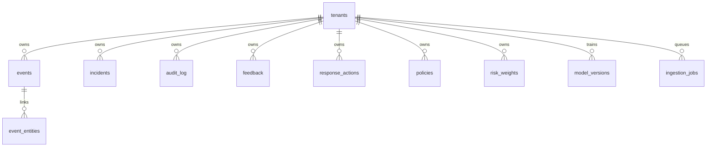

# Database Schema — SENTINEL-X

Source of truth: `server/db.js` (SQLite, WAL mode, foreign keys ON).

## Entity relationship (core)

## Tables (22)

| Table | Purpose |
|-------|---------|
| `tenants` | Multi-tenant root |
| `events` | Normalized security event payloads (JSON) |
| `incidents` | Lifecycle status + analyst notes |
| `audit_log` | Immutable action trail |
| `feedback` | Analyst classification for learning |
| `response_actions` | Approvals / rejections with evidence IDs |
| `policies` | Risk thresholds, allowed actions, approval rules |
| `risk_weights` | Per-event-type scoring weights |
| `entities` / `event_entities` | Entity graph persistence |
| `topology_entities` / `topology_relationships` | Security digital twin |
| `analysis_snapshots` | Point-in-time investigation state |
| `simulated_controls` | Demo containment state |
| `replay_runs` | Run ID isolation per scenario replay |
| `model_versions` / `model_artifacts` / `model_drift` | ML lifecycle |
| `ingestion_jobs` | Async connector queue + retry |
| `connector_state` | Wazuh and other connector config |
| `external_investigations` | Bounded external query results |
| `response_rollbacks` | Simulated rollback audit |
| `schema_migrations` | Versioned DDL |

## Indexes

- `events(tenant_id, scenario_id, timestamp)`
- `audit_log(tenant_id, timestamp)`
- `ingestion_jobs(tenant_id, status, updated_at)`

## Replay isolation

`replay_runs.run_id` scopes `feedback`, `response_actions`, `audit_log`, and `analysis_snapshots` so historical investigation states do not leak future evidence.
